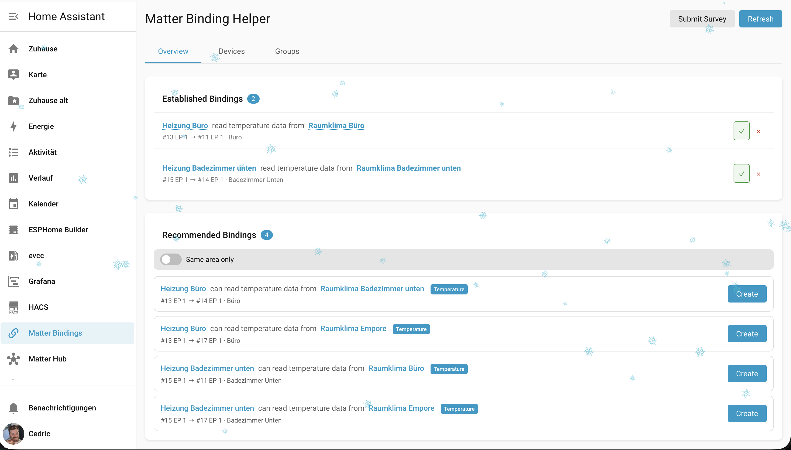

# Matter Binding Helper for Home Assistant

A Home Assistant custom integration that provides a user interface for managing Matter device bindings through the official Matter server.



## Features

- **View Bindings**: List all existing Matter bindings between devices with cluster details
- **Create Bindings**: Set up new bindings with smart recommendations and compatibility checking
- **Delete Bindings**: Remove existing bindings
- **Binding Recommendations**: Automatic suggestions for compatible device bindings
- **Automation Templates**: Pre-built automation templates for common scenarios (switches, buttons, etc.)
- **Telemetry**: Optional anonymous device telemetry to improve Matter ecosystem understanding

## What are Matter Bindings?

Matter bindings allow devices to communicate directly with each other without going through a central controller. For example, you can bind a Matter switch to a Matter light, allowing the switch to control the light directly - even if your Home Assistant server is offline.

## Requirements

- Home Assistant 2024.1.0 or newer
- Matter integration configured and running
- At least two Matter devices (for creating bindings)

## Installation

### HACS (Recommended)

1. Open HACS in Home Assistant
2. Click on "Integrations"
3. Click the three dots in the top right and select "Custom repositories"
4. Add this repository URL and select "Integration" as the category
5. Click "Add"
6. Search for "Matter Binding Helper" and install it
7. Restart Home Assistant

### Manual Installation

1. Download the latest release from GitHub
2. Copy the `custom_components/matter_binding_helper` folder to your Home Assistant's `custom_components` directory
3. Restart Home Assistant

## Configuration

1. Go to **Settings** > **Devices & Services**
2. Click **Add Integration**
3. Search for "Matter Binding Helper"
4. Follow the setup wizard

After configuration, a new "Matter Bindings" panel will appear in your Home Assistant sidebar.

## Development

### Quick Start with Docker Compose (Recommended)

The easiest way to develop is using Docker Compose:

```bash
# Start Home Assistant with the component mounted
make start

# Or with frontend hot-reload
make dev
```

Home Assistant will be available at http://localhost:8123

### Available Make Commands

```bash
make help              # Show all commands
make start             # Start HA (builds frontend first)
make stop              # Stop all containers
make restart           # Restart HA (picks up Python changes)
make logs              # Show HA logs
make logs-component    # Show only Matter Binding Helper logs
make frontend-watch    # Watch frontend for changes
make dev               # Start HA + frontend watch mode
make clean             # Clean everything
```

### Manual Setup

#### Prerequisites

- Python 3.11+
- Node.js 18+
- Docker & Docker Compose (for containerized development)

#### Backend Setup

```bash
# Create virtual environment
python -m venv venv
source venv/bin/activate  # On Windows: venv\Scripts\activate

# Install dependencies
pip install -r requirements_dev.txt
```

#### Frontend Setup

```bash
cd frontend

# Install dependencies
npm install

# Build for development (with watch)
npm run watch

# Build for production
npm run build
```

### Project Structure

```
ha-matter-binding-helper/
├── custom_components/
│   └── matter_binding_helper/
│       ├── __init__.py          # Integration setup
│       ├── manifest.json        # Integration manifest
│       ├── const.py             # Constants
│       ├── api.py               # WebSocket API
│       ├── matter_client.py     # Matter server client
│       ├── config_flow.py       # Configuration flow
│       ├── frontend/            # Built frontend assets
│       └── translations/        # Localization files
├── frontend/
│   ├── src/                     # Frontend source code
│   ├── package.json
│   └── rollup.config.js
└── hacs.json                    # HACS configuration
```

## WebSocket API

The integration exposes several WebSocket commands:

| Command | Description |
|---------|-------------|
| `matter_binding_helper/list_nodes` | List all Matter nodes |
| `matter_binding_helper/list_bindings` | List bindings for a node/endpoint |
| `matter_binding_helper/create_binding` | Create a new binding |
| `matter_binding_helper/delete_binding` | Delete an existing binding |
| `matter_binding_helper/list_groups` | List Matter groups |

## Contributing

Contributions are welcome! Please feel free to submit a Pull Request.

## License

MIT License - see LICENSE file for details.

## Acknowledgments

- [Home Assistant](https://www.home-assistant.io/) - The home automation platform
- [python-matter-server](https://github.com/home-assistant-libs/python-matter-server) - The official Matter server for Home Assistant
